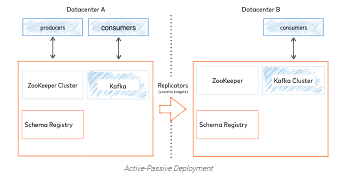

# Documentation

This repo use for managing consumer kafka that consumer send data to specific destination using rest API.  
This application support to :
    
  - create consumer
    ```sh
    curl -X POST 'http://localhost:8090/stream-failed-PE/consumer-management/create' -H 'Content-Type: application/json' --data-raw '{   
    "topicName" : "cleanTopicPE",
    "consumerId" : "consumerPE"
    }'
    ```
  - check active consumers
    ```sh
    curl -X GET 'http://localhost:8090/stream-failed-PE/consumer-management'
    ```
  - activate consumer
    ```sh
    curl -X POST 'http://localhost:8090/stream-failed-PE/consumer-management/activate' -H 'Content-Type: text/plain' --data-raw 'consumerPE'
    ```
  - deactivate consumer
    ```sh
    curl -X POST 'http://localhost:8090/stream-failed-PE/consumer-management/deactivate/' -H 'Content-Type: text/plain' --data-raw 'consumerPE'
    ```
  - pause consumer
    ```sh
    curl -X POST 'http://localhost:8090/stream-failed-PE/consumer-management/pause/' -H 'Content-Type: text/plain' --data-raw 'consumerPE'
    ```
  - resume consumer
    ```sh
    curl -X POST 'http://localhost:8090/stream-failed-PE/consumer-management/resume/' -H 'Content-Type: text/plain' --data-raw 'consumerPE'
    ```

Technology used for this repo :
- Java 8
- Spring Kafka
- Spring Web
- Broker Kafka

## Features

- Consume data from broker kafka
- Send consumed data from kafka to specific destination using rest API . If data failed to sent , then resending data scenario will play role , explain below :
- In almost all PE side, data can be saved to database , if and only if value date in data same as date of sending data. If mandiri give outdated data [data by date 2000] and PE just response it same as valid data then mandiri cannot track data that sent to PE. In that case, If data success to sent but PE must respond as invalid data [response code 4XX] , then data will write to file as invalid-data.
- Any activity to application, it will record in log files
- Monitoring data in C3 using MonitoringProducerInterceptor & MonitoringConsumerInterceptor
- Support Consumer Offset Translation to support FailOver scenario using ConsumerTimestampsInterceptor





## How to use

### Local
- Make sure your broker kafka is alive
- change destination broker kafka to your local or remote broker, example :
   ```sh
   kafka.consumer.broker=localhost:8080
   ```
- Set spring profiles for choose which environment that you want use . In intellij , use add VM options setting .
  example below for test environment
   ```sh
   -Dspring.profiles.active=test 
   ```

### Deploy to web application server [war]

- in maven terminal, bundle project to war file for production environment
   ```sh
   mvn clean package -P production
   ```
- in project directory, go to target folder and move war file to your web application service

# Security
This repository provided 2 security feature : Basic AUTH & Data Encryption in application layer.
This password use Lower letters , Upper letters, Number & Special Character with different length.
* Basic AUTH (user : 10 letter , password : 10 letter)
* Data Encryption (15 letter)

## Estimated brute force approach for Data Encryption
* https://password.kaspersky.com/ ==> 3261 centuries , bruteforce with an average home computer
* http://password-checker.online-domain-tools.com/ ==> 2 billion years , Medium size botnet
* http://lastbit.com/pswcalc.asp ==> 348.563.773.059  years , 500000 passwords per second using 100.000 computers

## Estimated brute force approach for Basic Auth
* https://password.kaspersky.com/ ==> 10000+ centuries , bruteforce with an average home computer
* http://password-checker.online-domain-tools.com/ ==> About 1 sextillion year , Medium size botnet
* http://lastbit.com/pswcalc.asp ==> 2.842.093 trillion years , 500.000.000 passwords per second using 1.000.000 computers

# Note
Need cron job for cleaning data automatically for data log

# License

MIT

**Free Software, Hell Yeah!**


