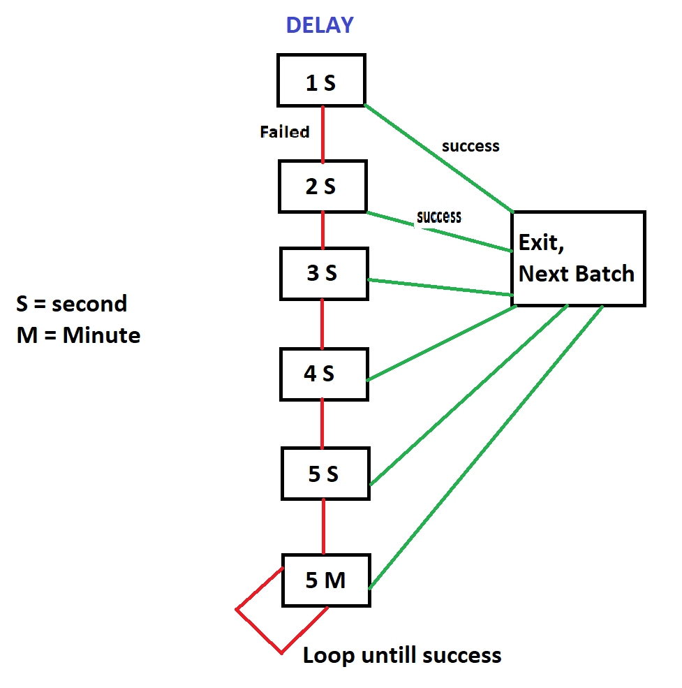

# Documentation

This repo use for managing consumer kafka that consumer send data to specific destination using rest API.  
This application support to :
    
  - create consumer
    ```sh
    curl -X POST 'http://localhost:8090/stream-failed-PE/consumer-management/create' -H 'Content-Type: application/json' --data-raw '{   
    "topicName" : "cleanTopicPE",
    "consumerId" : "consumerPE"
    }'
    ```
  - check active consumers
    ```sh
    curl -X GET 'http://localhost:8090/stream-failed-PE/consumer-management'
    ```
  - activate consumer
    ```sh
    curl -X POST 'http://localhost:8090/stream-failed-PE/consumer-management/activate' -H 'Content-Type: text/plain' --data-raw 'consumerPE'
    ```
  - deactivate consumer
    ```sh
    curl -X POST 'http://localhost:8090/stream-failed-PE/consumer-management/deactivate/' -H 'Content-Type: text/plain' --data-raw 'consumerPE'
    ```
  - pause consumer
    ```sh
    curl -X POST 'http://localhost:8090/stream-failed-PE/consumer-management/pause/' -H 'Content-Type: text/plain' --data-raw 'consumerPE'
    ```
  - resume consumer
    ```sh
    curl -X POST 'http://localhost:8090/stream-failed-PE/consumer-management/resume/' -H 'Content-Type: text/plain' --data-raw 'consumerPE'
    ```

Technology used for this repo :
- Java 8
- Spring Kafka
- Spring Web
- Broker Kafka

## Features

- Consume data from broker kafka
- Send consumed data from kafka to specific destination using rest API . If data failed to sent , then resending data scenario will play role , explain below :



## How to use

### Local
- Make sure your broker kafka is alive
- change destination broker kafka to your local or remote broker, example :
   ```sh
   kafka.consumer.broker=localhost:8080
   ```
- Set spring profiles for choose which environment that you want use . In intellij , use add VM options setting .
  example below for test environment
   ```sh
   -Dspring.profiles.active=test 
   ```

### Deploy to web application server [war]

- in maven terminal, bundle project to war file for production environment
   ```sh
   mvn clean package -P production
   ```
- in project directory, go to target folder and move war file to your web application service

# Note
Need cron job for cleaning data automatically for data log

# License

MIT

**Free Software, Hell Yeah!**


